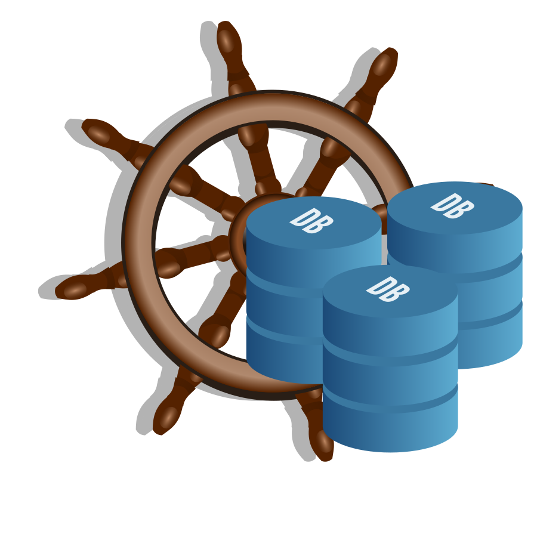

= Kubernetes Simple Database Provisioner
:toc:

[link=http://www.apache.org/licenses/LICENSE-2.0.txt]





The simple database provisioner allows to create and remove databases and user credentials (secretes) via
kubernetes ressources on an existing DBMS server.

It was created as a simpler and more resilient alternative to setting up databases with OSBA.

== Status

**CURRENT STATUS: ALPHA**

Not intended for production use yet. Tests, refactoring
and updating the documentation are missing.


== Concept

* DBMS servers have to be created by some other tool (e.g. manually, or terraform)
* DBMS servers are identified in the config via a unique name and a secret with
  the connection information
* DBMS management is (currently) static and requires a pod restart
* Database Instance and Binding management is dynamic via two Custom Resource Definitions

== Configuration

=== Application Config File

**config.yaml**
```yaml

dbmsServers:
  dev-postgres:
    secret: dev-postgres-secret

persistence:
  type: file
  location: ./sdp.db.yaml
```

=== Database Format (DRAFT)

The database format currently is only a rough draft and might
change during development according to the needs (e.g. list instead
of map, etc.).


```yaml

namespaces:
  master:
    instances:
      mynamespace-myservice-database:
        dbmsServer: dev-postgres
        databaseName: mynamespace-myservice
    bindings:
      mynamespace-myservice-binding:
        instanceName: mynamespace-myservice-database
        secretName: mynamespace-myservice-database-secret

```

=== DBMS Secret

```yaml
apiVersion: v1
kind: Secret
type: Opaque
metadata:
  name: dev-postgres-secret
  namespace: simpledatabaseprovisioner
data:
  host: MTM0MDg2NjUtMTk5Yy00ZWMzLTkyZTItMDRmN2QwOTFlNjQxLnBvc3RncmVzLmRhdGFiYXNlLmF6dXJlLmNvbQ==
  port: NTQzMg==
  username: Z3pyZGFud3QzYUAxMzQwODY2NS0xOTljLTRlYzMtOTJlMi0wNGY3ZDA5MWU2NDE=
  password: Q2pCdGpMRDU2bzVpNmk0SQ==
  database: bm5zb2RqY3Y5aw==
  ssl: ZmFsc2U=
```

== Custom Resource Definitions

==== CDR: SimpleDatabaseInstance

```yaml
apiVersion: apiextensions.k8s.io/v1beta1
kind: CustomResourceDefinition
metadata:
  name: simpledatabaseinstances.k8s.ecodia.de
spec:
  group: k8s.ecodia.de
  version: v1
  scope: Namespaced
  conditions:
  stored_versions: []
  names:
    plural: simpledatabaseinstances
    singular: simpledatabaseinstance
    kind: SimpleDatabaseInstance
    shortNames:
     - sdi
```

**Example**

```yaml
apiVersion: k8s.ecodia.de/v1
kind: SimpleDatabaseInstance
metadata:
  name: mynamespace-myservice-database
spec:
  dbmsServer: dev-postgres
  databaseName: mynamespace-myservice
```

==== CDR: SimpleDatabaseBinding

```yaml
apiVersion: apiextensions.k8s.io/v1beta1
kind: CustomResourceDefinition
metadata:
  name: simpledatabasebindings.k8s.ecodia.de
spec:
  group: k8s.ecodia.de
  version: v1
  scope: Namespaced
  names:
    plural: simpledatabasebindings
    singular: simpledatabasebinding
    kind: SimpleDatabaseBinding
    shortNames:
     - sdb
```

**Example**

```yaml
apiVersion: k8s.ecodia.de/v1
kind: SimpleDatabaseBinding
metadata:
  name: mynamespace-myservice-binding
spec:
  instanceName: mynamespace-myservice-database
  secretName: mynamespace-myservice-database-secret
```

== Development

This controller is based on the kubernetes samplecontroller:

https://github.com/kubernetes/sample-controller


=== Hands on

Let's jump right into some hands on commands

==== Run the controller

* The controller automatically detects if it is run inside a
  cluster or can connect to a cluster via the kubernetes api

* start minikube

* run controller.py , then load the example resources and watch
  how events are read

   kubectl apply -f examples/sdi-example.yaml
   kubectl apply -f examples/sdb-example.yaml

==== Delete databases and bindings

For testing purposes it might be necessary to remove the instances and bindings:

   kubectl delete sdi/mynamespace-myservice-database
   kubectl delete sdb/mynamespace-myservice-binding


==== Delete Custom Resource Definitions

For testing purposes it might be necessary to remove the custom resource definitions:

    kubectl delete crd/simpledatabasebindings.simpledatabaseprovisioner.k8s.ecodia.de
    kubectl delete crd/simpledatabaseinstances.simpledatabaseprovisioner.k8s.ecodia.de


=== Code Architecture


[blockdiag]
----
blockdiag {
   // Set labels to nodes.
   A [label = "foo"];
   B [label = "bar"];
   // And set text-color
   C [label = "baz"];

   // Set labels to edges. (short text only)
   A -> B [label = "click bar", textcolor="red"];
   B -> C [label = "click baz"];
   C -> A;
}
----

=== Run tests

To run the tests you need minikube and a postgres database
with the correct user credentials:

    minikube start
    docker run --rm --name sdp-postgres-testdb -p 5432:5432 -e POSTGRES_PASSWORD=postgres -e POSTGRES_USER=postgres postgres

Then start the tests with:
    go test simple-database-provisioner...

=== Generate custom resource types

The simple-database-provisioner controller is based on https://github.com/kubernetes/sample-controller .

It makes use of the generators in k8s.io/code-generator to generate a typed client, informers, listers and deep-copy functions. You can do this yourself using the ./hack/update-codegen.sh script.